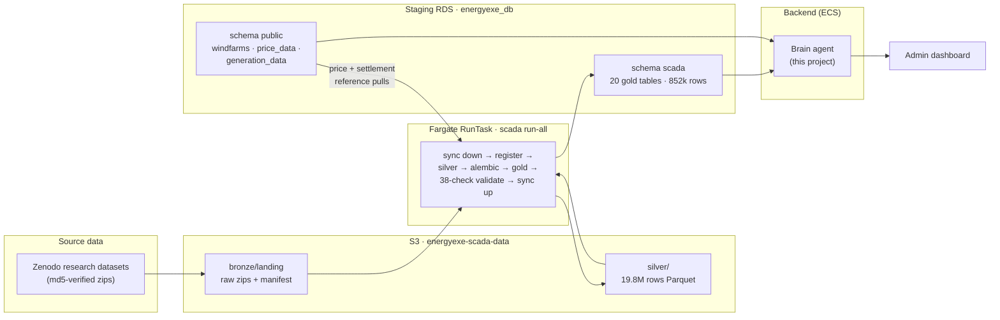
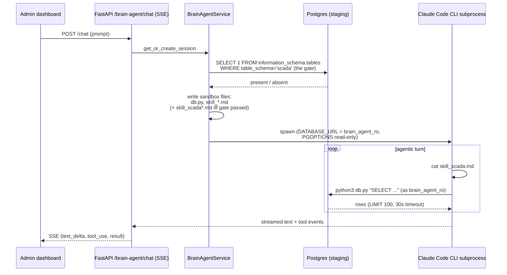
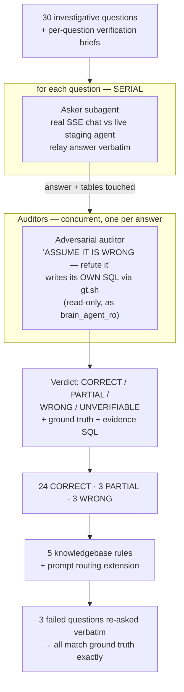
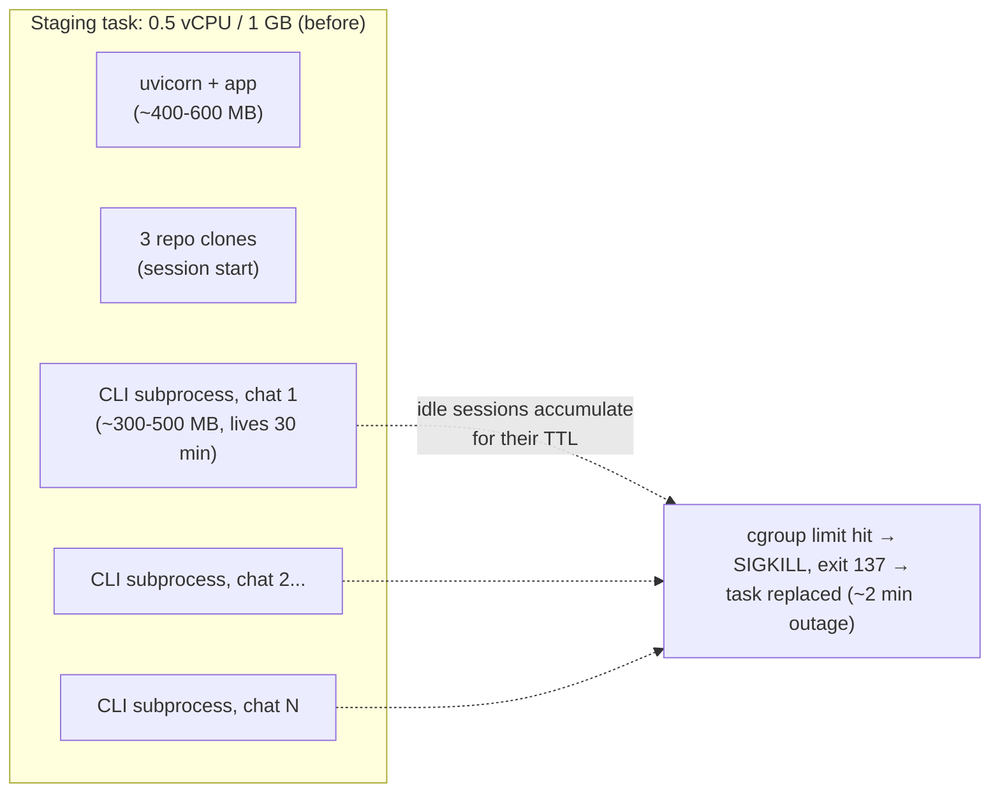

# Teaching the Platform's AI Agent to Read Wind-Farm SCADA Data

**The complete engineering story: design, alternatives, adversarial testing, and everything that broke along the way.**

*2026-07-16/17 · energyexe-core-backend + energyexe-scada-pipeline · Live on staging*

This is the full account of how we connected the EnergyExe brain agent — the AI assistant on the admin dashboard — to the SCADA gold data, written as a start-to-finish narrative for the team. It covers every design decision and the alternatives we rejected, the exact implementation, three rounds of increasingly hostile testing, six real defects and their fixes, an infrastructure failure the testing exposed, and the limitations that remain. Nothing here is hypothetical: every number, query, and exit code appeared in the real system.

---

## Part I — The system we started with

### The data pipeline, end to end

The SCADA platform is a separate repository (`energyexe-scada-pipeline`) that ingests public 10-minute turbine data for three research wind farms. The datasets are published on Zenodo by the farms' operators: Hill of Towie (21 × Siemens SWT-2.3, 48.3 MW, Scotland), Kelmarsh (6 × Senvion MM92, 12.3 MW, England), and Penmanshiel (14 × Senvion MM82, 28.7 MW, Scotland — with no turbine T03, a fact that becomes a test case later).

The pipeline follows a medallion architecture. Bronze is the immutable raw zips with an md5 manifest. Silver is normalized 10-minute Parquet — 19,835,477 rows across 41 turbines, 95.07% passing quality checks, every failing row flagged rather than deleted. Gold is the analytics layer: twenty Postgres tables that answer operational questions directly.

Since v0.6.0 the whole thing runs in AWS. A Fargate task (8 vCPU / 48 GB, launched on demand) syncs an S3 bucket to a local working directory, runs the *unchanged, locally-validated* pipeline, and syncs results back — bronze manifest last, as the commit marker. Gold lands in the **staging** RDS, in a schema called `scada` that sits alongside the platform's own `public` schema. The prod cut, when it happens, is a one-secret repoint.



The one bridge between the two worlds is deliberate and narrow: `scada.dim_farm.windfarm_id` points at `public.windfarms.id`. Only Hill of Towie is linked (id 7309), because only Hill of Towie exists in the commercial platform. That single foreign key is what lets the gold layer price its losses against real day-ahead prices and reconcile SCADA energy against grid settlement data — the pipeline calls this the money spine.

### The gold schema in detail

Everything in gold obeys one grain rule: the atomic unit is the **turbine-day**, keyed `(farm, turbine, date_utc)`, the UTC calendar day. Farm-level numbers are materialized into their own roll-up table at build time — never left for a consumer to recompute — and percentages must still be recomputed as a ratio of sums, never averaged.

The frame has a history worth knowing (pipeline gotcha 57). Gold originally bucketed by farm-local civil days (Europe/London), which made monthly totals differ from any UTC-keyed source by up to ±0.7% in BST months — the two month-edge hours land in different months — and by exactly 0.0000% in December–February, the zero-in-winter fingerprint that identifies the effect. After that cost the team a full QC investigation, the schema was flipped: **everything is now UTC-keyed** (`date_utc`, decision 2026-07-29), analytics and money lanes alike, recomputed from the 10-minute silver intervals (relabelling alone would have been wrong — during BST a local-day row spans two UTC calendar days). Every UTC day has exactly 144 intervals; the DST special cases (138/150) are gone. Totals now match raw SCADA, OEM reports, and the main platform's aggregates exactly, every month. The residual caveat is mirrored: against GB-LOCAL-keyed sources — Elexon settlement statements, invoices — daily £ rows no longer correspond 1:1 to statement lines; that reconciliation is a query-time mapping, and small BST-edge differences against such sources are the frame, not a data error. `scada.energy_monthly_utc` remains as the direct per-turbine monthly rollup (same clock as everything else since the flip).

```mermaid
erDiagram
    dim_farm ||--o{ dim_turbine : "farm"
    dim_farm ||--o{ dim_signal_capability : "farm"
    dim_farm ||--o{ farm_kpis_daily : "farm"
    dim_farm ||--o{ losses_hourly : "farm"
    dim_farm ||--o{ revenue_impact_daily : "farm (HoT only)"
    dim_farm ||--o{ settlement_recon_daily : "farm (HoT only)"
    dim_turbine ||--o{ dim_turbine_config : "farm, turbine"
    dim_turbine ||--o{ completeness_daily : "farm, turbine"
    dim_turbine ||--o{ energy_daily : "farm, turbine"
    dim_turbine ||--o{ energy_monthly_utc : "farm, turbine"
    dim_turbine ||--o{ availability_daily : "farm, turbine"
    dim_turbine ||--o{ losses_daily : "farm, turbine"
    dim_turbine ||--o{ power_curve_bins : "farm, turbine, config"
    dim_turbine ||--o{ power_curve_bins_yearly : "farm, turbine, config"
    dim_turbine ||--o{ turbine_performance_yearly : "farm, turbine, config"
    windfarms_public |o..o| dim_farm : "windfarm_id = 7309 (HoT)"

    dim_farm {
        string farm PK "slug: hill_of_towie, kelmarsh, penmanshiel"
        string name
        string tz "Europe/London"
        string source_format "siemens_wps or greenbyte"
        int windfarm_id "nullable, only HoT"
        string bidzone "EIC 10YGB----------A"
        float rated_kw_total
    }
    dim_turbine {
        string farm PK
        string turbine PK "T01... / KWF1..."
        string oem
        string model
        float rated_kw
        date cod "commercial operation date"
    }
    dim_turbine_config {
        string config PK "baseline or aeroup (SCD2 epoch)"
        date valid_from
        date valid_to "NULL = open"
    }
    dim_event_category {
        string source_format PK
        string category PK
        bool is_available
        string loss_bucket
        int precedence "lower wins overlaps"
    }
    dim_signal_capability {
        string signal PK
        string status "reported, all_null, absent"
        float null_pct
    }
    completeness_daily {
        date date_utc PK
        int expected_intervals "flat 144 (UTC days)"
        float completeness_pct
        bool pre_cod
    }
    energy_daily {
        date date_utc PK
        float energy_kwh
        string energy_method "meter, power_integral, mixed, none"
        int intervals_gap "counted, NEVER scaled"
    }
    availability_daily {
        date date_utc PK
        string method "timer_based or event_based"
        float availability_pct
        float unavail_forced_h "IEC split (event lane only)"
    }
    losses_daily {
        date date_utc PK
        float potential_kwh "epoch curve x measured wind"
        float loss_total_kwh "negatives = over-performance"
        float loss_curtailment_kwh "needs setpoint signal"
    }
    farm_kpis_daily {
        date date_utc PK
        float energy_kwh
        float availability_pct "ratio-of-sums, pre-COD excluded"
        float capacity_factor
    }
    losses_hourly {
        datetime hour_utc PK "tz-aware, 6 intervals per hour"
        float loss_total_kwh
        int n_turbines
    }
    revenue_impact_daily {
        date date_utc PK
        string currency "GBP"
        float revenue_gross_gbp
        float revenue_curtailment_gbp "negative on negative prices"
        int hours_unpriced "counted, never scaled"
    }
    settlement_recon_daily {
        date date_utc PK
        float scada_energy_mwh
        float settlement_metered_mwh
        float energy_delta_mwh "positive ~2% = site loss"
    }
    energy_monthly_utc {
        date month_utc PK "first day of UTC month"
        float energy_kwh "same intervals, UTC buckets"
    }
    power_curve_bins {
        decimal ws_bin PK "0.5 m/s lower edge"
        float power_mean_kw
        int n
    }
    power_curve_bins_yearly {
        int year PK
        decimal ws_bin PK
    }
    turbine_performance_yearly {
        int year PK
        float performance_index "1.0 = epoch average"
        float ws_coverage_pct "below 90 = unreliable"
    }
    windfarms_public {
        int id PK "public schema"
        string name
    }
```



Sizes, for intuition: each daily turbine fact holds 142,566 rows; `farm_kpis_daily` holds 10,002 farm-days; `losses_hourly` 239,499 farm-hours; the money lane 3,762 revenue days and 3,680 settlement days (Hill of Towie only). The whole schema is roughly 852 thousand rows in 245 MB — a rounding error inside the 156 GB staging database, and small enough that every reasonable query returns in milliseconds off the `(farm, date_utc)` indexes.

The semantics are where the richness lives, and they matter for everything that follows. Losses are computed as *potential minus actual*, where potential applies the turbine's own power curve — per SCD2 config epoch, because Hill of Towie's turbines had an AeroUp retrofit that changed their aerodynamics mid-history — to the measured wind. Negative losses are kept, because they are real over-performance. Curtailment is attributed only when a power-setpoint signal is present *and binding*; only Hill of Towie's Siemens data has that signal, so Kelmarsh and Penmanshiel show zero curtailment **by construction**, not by fact. Availability is IEC 61400-26 time-based system availability, computed through two different lanes: OEM timers for Hill of Towie (whose unavailability all lands in an unclassified bucket) and IEC-categorized events for the Greenbyte farms (which get the forced / scheduled / external / requested split, with a precedence rule — lower number wins — for overlapping events).

### The brain agent

On the other side of the bridge sits the brain agent: a Claude-Agent-SDK-based assistant embedded in the FastAPI backend, reachable from the admin dashboard (and, in a locked-down variant, from the client portal). Its architecture constrains everything this project did, so it's worth being precise.



Three facts shape the whole design. First, every conversation spawns a **Claude Code CLI subprocess** inside the backend container, and that subprocess stays alive for the session's 30-minute idle TTL — this is a memory commitment that will detonate spectacularly in Part IX. Second, SQL is not a bespoke tool: the agent runs `python3 db.py "SELECT ..."` through its ordinary Bash tool, and `db.py` enforces SELECT/WITH-only, an automatic `LIMIT 100`, and a 30-second statement timeout, while the hard security boundary is the Postgres role in `DATABASE_URL` — `brain_agent_ro`, created by an earlier migration with SELECT on schema `public` and `default_transaction_read_only=on`. Third, the agent's knowledge of the database is **not introspected**; it is curated markdown ("skill files") written into the session sandbox at creation time and lazily read by the agent with `cat` when a question calls for it.

There is also a second surface — the client portal agent — running under a much stricter role (`brain_agent_client_ro`) with an explicit table allowlist, no code access, and introspection blocked. Keep it in mind only to note that this project touched it in exactly zero ways, on purpose.

---

## Part II — The two gaps

With the gold data live on staging and the agent live on the same database, connecting them sounds like it should be free. It wasn't, because of two independent gaps.

The first gap was **access**. `brain_agent_ro`'s grants were written when `public` was the only schema that mattered: `GRANT SELECT ON ALL TABLES IN SCHEMA public`, plus default privileges for future tables — in `public`. Postgres schemas are permission boundaries; without `USAGE` on schema `scada`, every query the agent could possibly write against the gold tables would fail before touching a row.

The second gap was **knowledge**. The agent discovers tables from its skill files, and the skill files had never heard of SCADA. Even with grants in place, the agent would have had to introspect `information_schema` to find the tables, and introspection yields column names without semantics — nothing about kWh versus MWh, ratio-of-sums, pre-COD exclusion, config epochs, or the setpoint signal gap. As the testing campaigns would prove emphatically, the semantics are where correctness lives.

---

## Part III — Access: one migration that behaves differently in three environments

The obvious place to grant access is the repository that created the role — core-backend, whose alembic history contains the migration that created `brain_agent_ro` in the first place. We rejected that, and the reasoning is a useful pattern.

Core-backend migrations run against **every** environment the backend deploys to, including prod. Prod has no `scada` schema yet and won't until the scada prod cut. A core-side grant migration would therefore need existence guards, and worse, it would run *once*, before the schema exists in prod — leaving prod silently ungrated after the cut unless someone remembered to re-run it. The grant would also live in the wrong home: the schema belongs to the pipeline, and its access policy should travel with it.

Manual `GRANT` statements over psql were rejected for the usual reasons — unreproducible, unauditable, and guaranteed to be forgotten at the prod cut. Granting from the pipeline's runtime load path was rejected because it entangles a one-time DDL policy with a load that runs constantly.

What we shipped instead is a migration in the **scada repository** (`a3f8c1d97b02`), whose entire body is conditional on the role existing:

```sql
DO $$
BEGIN
    IF EXISTS (SELECT FROM pg_roles WHERE rolname = 'brain_agent_ro') THEN
        GRANT USAGE ON SCHEMA scada TO brain_agent_ro;
        GRANT SELECT ON ALL TABLES IN SCHEMA scada TO brain_agent_ro;
        ALTER DEFAULT PRIVILEGES IN SCHEMA scada
            GRANT SELECT ON TABLES TO brain_agent_ro;
    END IF;
END
$$;
```

The conditional makes the migration self-adapting across all three environments it will ever meet. On a laptop, where the local dev database has no such role, it is a silent no-op. On staging, where the role exists (it arrived with the prod-snapshot restore), it grants. And on prod, the same migration will run automatically the first time the pipeline's alembic executes there — which is part of the prod cut anyway — and grant then. The prod cut inherits agent access without anyone thinking about it.

Two Postgres subtleties carry the durability. `ALTER DEFAULT PRIVILEGES` without a `FOR ROLE` clause binds to the *current user* — and the migration's connection user (`SCADA_DATABASE_URL`) is the same user that creates every gold table, so tables added by future migrations inherit SELECT automatically. And because gold rebuilds are transactional delete+insert rather than drop+create, table-level grants survive every one of the pipeline's rebuilds; nothing ratchets loose over time.

Verification was done as the role itself, not as an admin looking at catalogs: connect to staging as `brain_agent_ro`, run `SELECT count(*) FROM scada.farm_kpis_daily` and get 10,002, then attempt an `INSERT` and receive `cannot execute INSERT in a read-only transaction`. The downgrade path mirrors the conditional with `REVOKE`s.

One scope decision belongs in this part because it is access policy: the client-portal role got **nothing**. Its allowlist is a deliberately narrow attack surface hardened under EPR-59, the SCADA farms are not client assets, and widening that surface is a product decision to be made explicitly, not a side effect. The user chose admin-only, and the implementation makes the client exclusion structural — no grants, and (as the next parts show) no knowledge either.

---

## Part IV — Knowledge: writing the textbook instead of handing over the catalog

For the knowledgebase we put three options on the table. A database-driven store in the style of our `methodology_sections` pattern — a table of sections, admin-UI editing, composed into the sandbox at session start — would allow edits without deploys, at the price of a new table, CRUD endpoints, and UI work, for content that encodes column-level semantics no one should be editing outside code review anyway. A hybrid (static schema reference plus a DB-driven free-text section) inherits the complexity of both. The third option, chosen: **git-versioned strings in `brain_agent_skill_files.py`**, exactly like the platform's existing skill files. SCADA semantics change when the pipeline changes; versioning the knowledge with code means zero drift, reviewable diffs, and — crucially, as it turned out — the ability to write *canary tests* against the knowledge itself.

We split the content into two files so the agent's lazy loading stays cheap and purposeful. `skill_scada.md` is the reference: identity (the farm slugs, the turbine codes, the single windfarm_id 7309 link, the coverage windows — Hill of Towie through April 2026, the others through December 2024, all static research data), all twenty tables with primary keys and load-bearing columns grouped by grain (the original sixteen, plus the alarm lane — `dim_alarm_code`, `alarm_events`, `alarm_code_daily` — and the UTC-frame reconciliation table `energy_monthly_utc`), the domain semantics (both availability lanes, loss attribution, the curtailment signal gap, config epochs), and the unit conventions (kWh in the fact tables, MWh in the money tables, GBP with explicit currency columns, DST interval counts, `pre_cod`). `skill_scada_queries.md` is the cookbook: efficiency rules first, then about eight ready-made patterns — monthly farm KPIs, loss Paretos, worst-day and worst-turbine rankings, revenue by cause, availability trends with the IEC split, baseline-versus-AeroUp power curve comparisons, settlement reconciliation, and the cross-schema price join, which we lifted almost verbatim from the pipeline's own `verify_staging_upload.py` because it was already proven correct.

Why curate at all, when the admin agent could introspect `information_schema` freely? Because introspection costs tokens on every conversation and returns the *least* valuable layer of knowledge. Column names are cheap; what prevents wrong answers is knowing that `energy_kwh` and `energy_mwh` coexist across table families, that a percentage over multiple days must be `SUM/SUM`, that zero curtailment at two farms is an artifact of a missing signal, that an "over-performance day" means the fleet's *net total* loss went negative. None of that is in the catalog. Roughly half the rules that ended up in these files did not exist on day one — they are the direct residue of defects found in testing, which is the strongest argument that curated semantics were the right investment.

The efficiency posture deserves a paragraph because we explicitly considered and rejected database work. No new views, no new indexes: the gold layer *is* the materialized, indexed serving layer, built by the pipeline precisely so consumers never re-aggregate. Instead of pre-joining convenience views (a second place for semantics to drift), the cookbook steers behavior — use `farm_kpis_daily` for farm-level questions rather than summing 142k turbine-day rows, filter on the indexed keys, schema-qualify everything because `scada` is not on the search path. `db.py`'s automatic LIMIT and statement timeout were already the right guardrails and needed no changes.

---

## Part V — The gate: one image, two worlds

The backend ships as a single image that serves staging today and, after any promotion, prod. Staging has the `scada` schema; prod will not until the cut. Teaching the agent about tables that do not exist in its database produces the worst kind of failure — confident queries against nothing — so the knowledge had to be environment-aware without being environment-configured.

We rejected an environment flag (`BRAIN_AGENT_SCADA=1`) because it creates configuration drift across two Terraform roots and a human step at the prod cut. We rejected always-shipping the knowledge for the reason above. We rejected holding the staging branch back from prod because promotions ship the whole staging image as one unit by design, and blocking that channel for one feature fights the release model.

The shipped mechanism is a **runtime presence check** at session creation. `BrainAgentService._scada_schema_present()` runs one query — `SELECT 1 FROM information_schema.tables WHERE table_schema='scada' AND table_name='dim_farm' LIMIT 1` — wrapped in try/except so that session creation can never fail on it, and skipped entirely for client sessions. Only when it returns true do two things happen: the two skill files are written into the sandbox, and a `{{SCADA_SKILL_LINES}}` placeholder in the admin system prompt is replaced with two index lines pointing at them (the same string-replacement mechanism the prompt already used for user names and repository paths). When it returns false, the placeholder collapses to nothing and the session is indistinguishable from the pre-SCADA world.

The consequences are exactly what we wanted. Prod promotions are inert: the code rides along, the gate fails, nothing surfaces. The prod cut is self-activating: the moment scada alembic runs against prod, the same deployed backend starts writing the skill files with zero code change. And a canary test enforces the invariant that makes this safe — SCADA content must never appear in the *unconditionally written* skill strings, because those go to every environment.

The context-efficiency accounting is worth stating plainly: the system prompt grows by exactly two one-line entries, and only in environments where the data exists. Everything else is pulled by the agent on demand. A conversation about ENTSOE prices pays zero tokens for SCADA's existence.

---

## Part VI — First contact

The first end-to-end test ran a local backend against the staging database (identical code, identical data, no risk to the shared environment) and asked: *"What was Hill of Towie's total energy and availability in 2024, and its top 3 worst loss days?"*

The mechanics worked on the first try, and the transcript is a nice illustration of the design paying off. The agent's first tool call was `cat skill_scada.md`. Its second and third were two `db.py` queries against `scada.farm_kpis_daily` — the roll-up, exactly as the cookbook steers — one computing annual totals with ratio-of-sums availability, one ordering by `loss_total_kwh DESC LIMIT 3`. The answer: 107.5 GWh, 96.2% availability, worst days 31 Jan 2024 (926.2 MWh lost, availability 80.2%), 28 Jan 2024, and 7 Dec 2024 — with the December day correctly read as pure grid curtailment at 99.6% availability, and a negative performance number correctly explained as over-performance. Four turns, 43 seconds, $1.25.

The second test ran against the *deployed* staging API and asked which farm had the highest curtailment loss in 2023. The numbers were right (Hill of Towie, 7,838 MWh; the others zero) — and the prose was subtly wrong, in a way that mattered. The agent presented zero curtailment at Kelmarsh and Penmanshiel as a physical fact about those farms. It is not. The pipeline attributes curtailment only when a power-setpoint signal binds (`power_setpoint_kw` present and below what the curve says the turbine would otherwise produce), and only Hill of Towie's data carries that signal. Zero is true-by-construction. We verified the attribution logic in the pipeline source (`compute.py`: the `_curtail_raw` mark requires the setpoint), then pinned the caveat into the skill: zero curtailment at the Greenbyte farms is a signal gap, never compare curtailment across farms. That was defect #1, found by the second conversation the agent ever had — an early omen that the knowledge, not the plumbing, would be where all the bugs lived.

---

## Part VII — The twenty-question battery

With the mechanics proven, the user asked the right question: *did you check with sample questions?* Two is not a test suite. We designed a twenty-question battery with two properties: **coverage** (every one of the sixteen tables exercised by at least one question) and **traps** (questions engineered so that a plausible-sounding wrong answer was available and detectable).

The traps are the interesting part. A monthly-energy question checks the kWh→MWh conversion. "What's Kelmarsh's *average daily availability*" invites `AVG(availability_pct)` — the wrong aggregate. "Show me SCADA data for Smøla" names a farm we don't have. "What's Kelmarsh's output this month (July 2026)?" probes whether the agent knows the datasets are static. "Compare curtailment across the three farms" is a regression test for defect #1. "How complete is Penmanshiel's data in 2018?" has a known ugly answer — a farm-wide validated-data blackout in Q1 2018 — and tests whether the agent reports data quality honestly.

The harness ran the questions against a local backend on the staging database, three at a time, and captured the full SSE stream per question. A detail that cost us an hour: the agent's final answer must be reassembled from the `text_delta` events, because the transcript in the final `result` event can lag the last message. Each answer was graded against the pipeline's own acceptance-report numbers.

**Eighteen of twenty passed cleanly**, several impressively. The agent found turbine T21 as a downtime outlier at 2,468 MWh — 28 times the fleet median — and suggested the right investigation. It ranked Kelmarsh's turbines by availability with the IEC forced/scheduled/external split and spotted that the two worst machines shared a failure signature. It handled the epoch-straddling degradation question by refusing to blend the baseline and AeroUp configs. It surfaced the Penmanshiel 2018 Q1 blackout unprompted, with a practical "safe to proceed?" matrix per use case. It computed the multi-year availability with explicit ratio-of-sums and showed the delta against the naive method. And it answered the two consistency probes — asked independently, in separate conversations — with the same £116.9K downtime figure.

The two failures shared a single root cause that we now consider the most transferable lesson of the project: **LLM routing keys on proper nouns, not category descriptions.** Question q04 asked about Penmanshiel's worst loss days *without using the word SCADA*. The agent looked in `public.windfarms`, found nothing, and answered "Penmanshiel is not in our database" — offering a helpful list of alternative Scottish wind farms, which made the wrong answer worse by making it more convincing. Question q08 asked for Hill of Towie's revenue loss by cause; since Hill of Towie *does* exist in the platform, the agent answered from platform anomaly tables — a defensible interpretation that nonetheless never mentioned the far richer SCADA revenue lane sitting one schema over. The prompt's index line — "SCADA 10-minute turbine data (schema scada): 3 research farms…" — described the category perfectly and routed nothing, because neither question contained the category. The fix put the three farm *names* in the prompt line, added "prefer schema scada for these farms," and forbade reporting them as missing. Both questions re-run verbatim: pass. A third, smaller find from this round: in one answer's suggested follow-up, the agent invented a table (`scada.fact_10min`); the skill now states that the sixteen documented tables are the *only* tables and that raw 10-minute rows live in the Parquet lake, not Postgres.

---

## Part VIII — The audit: assume everything is wrong

The battery had a structural weakness that its own success concealed. The grader (the engineer) evaluated answers against numbers he already knew, which means anything plausible-sounding in territory *without* a known number passed on vibes. The user's next instruction closed exactly that hole: *test from an investigative angle and assume it's incorrect.* Thirty new questions, every answer treated as guilty until proven innocent.

The architecture separated asking from judging. A workflow orchestrated thirty serial conversations against the **live staging agent** (serial for reasons Part IX makes painful), and for each answer spawned an independent **auditor** subagent with instructions that began, in effect: *assume this answer is wrong; refute it.* The auditor received the question, the answer verbatim, and a verification brief — the canonical SQL, the required caveat, the trap — and was required to write its **own** SQL (never reusing the agent's) against the same database through a read-only helper. Numbers had to match within 0.5% or obvious rounding; a wrong unit, wrong period, wrong farm, invented entity, or missing required caveat was a failure regardless of how good the prose looked. Verdicts: CORRECT, PARTIAL, WRONG, UNVERIFIABLE.



The question set mixed four families. Precise numerics with a single right answer: annual energies, revenue sums, the single worst farm-day in history, one turbine's one-year output. Method traps: the settlement-delta denominator, DST interval counts on 26 March 2023 (at the time gold used local days, so the correct answer was 138 — since the 2026-07-29 UTC flip every day is 144), an epoch-straddling performance index that has *two* rows for 2022. Consistency probes: does the sum of per-turbine energy equal the farm roll-up (it must, absent pre-COD rows); does the hourly loss frame sum to the daily loss for an arbitrary day (it does, to the watt-hour — same interval frame). And behavioral probes: a nonexistent turbine (Penmanshiel T03), a P50 target for a farm that has none, a request to *delete* data (the agent refused, explained the read-only constraint, and the auditor verified the rows still existed), a question with no year (the agent must state the period it chose), and the bait question — "which of the three farms is the most profitable?"

**The verdicts: 24 CORRECT, 3 PARTIAL, 3 WRONG.** The three wrongs are each worth telling properly, because each exposed a different class of failure.

**i05 — the coverage lie.** *"How many days of priced revenue data exist for Hill of Towie in 2025, and how many unpriced hours?"* The agent answered "365 days, 8,760 hours, complete coverage, no gaps" — from the **platform's** generation and price tables, having never read the SCADA skill at all. The auditor's query told a different story: `scada.revenue_impact_daily` holds **353 rows** for 2025, totaling 8,472 hours, with twelve calendar days absent entirely — September 11 through 22. Two failures compounded: the revenue phrasing hadn't triggered SCADA routing (the farm-name fix from the battery had shipped, but "priced revenue data" pattern-matched to platform tables anyway), and the agent *assumed* calendar completeness instead of counting. Confident, specific, plausible — and false. This is the answer that vindicates the entire adversarial approach: it would have sailed through any friendly review.

**i13 — the wrong column.** *"On how many days in 2024 did Hill of Towie's fleet over-perform its power curves, and what was the biggest day?"* The agent said 100 days, biggest +43.4 MWh. Ground truth: **79 days** where `loss_total_kwh < 0`, biggest on 10 July 2024 at **−40,681 kWh** (465,685 kWh actual against 425,004 kWh potential). The agent had filtered on the performance *bucket* column rather than the fleet net total, and mixed magnitudes between the two — its count of 100 didn't even reproduce from its own stated filter (the bucket filter gives 184). It got the date right, which is exactly the kind of partial correctness that makes wrong numbers dangerous.

**i30 — the seductive comparison.** *"Which of the three SCADA farms is the most profitable?"* The agent built revenue estimates for all three farms by multiplying their energy by average prices, ranked them, and crowned Penmanshiel. Only Hill of Towie has revenue data. The auditor's demolition was elegant: not only is the comparison impossible, the agent's own method wasn't even internally consistent — Hill of Towie's figure used real hourly-priced revenue while the other two used daily-average estimates, and applying the same estimate method to all three *changes the ranking*. Nothing in the knowledgebase had forbidden the comparison, so the agent's helpfulness filled the vacuum.

The three partials were minor but instructive: a settlement-delta reported with settlement in the denominator (2.21%) where our convention is SCADA in the denominator (2.16%) — defensible, but conventions exist to be pinned; a prose arithmetic slip where the agent wrote "~4,200 hours" for a gap its own correct table implied was 35,194 hours; and a table-inventory answer that used `pg_class.reltuples` for one count (126,672) where the exact count was 142,566 — a stale planner estimate presented alongside fifteen exact ones.

The fixes landed as five knowledgebase rules and one prompt change. The value-lane tables are not calendar-complete: for coverage questions, count rows and sum hour columns, never assume 365/8,760, and never answer coverage for these farms from platform tables. An over-performance day means `loss_total_kwh < 0`. Cross-farm profitability ranking is forbidden — say why, offer labeled energy and loss comparisons instead. The settlement delta convention is `SUM(energy_delta_mwh) / SUM(scada_energy_mwh)`. And a discipline rule at the top of the cookbook: every number you state must come from a query result — no prose arithmetic, exact `count(*)` only. The prompt's routing line was extended to name revenue, pricing, settlement, and data-coverage questions explicitly.

All three failed questions were then re-asked **verbatim** against the deployed staging agent. i05 now reads the skill first, queries `revenue_impact_daily`, reports 353 days and 8,456 priced hours, and volunteers the twelve missing September days with the caveat that value-lane tables aren't calendar-complete. i13 reports 79 days and −40.7 MWh on 10 July using the correct definition — while still showing the bucket breakdown, correctly labeled. i30 refuses to rank, presents a data-availability table, names the average-price estimate method as unsound, and offers energy, availability, and capacity-factor comparisons instead. Each matched the auditor's ground truth to the digit.

---

## Part IX — The infrastructure subplot: how testing an agent load-tested a container to death

This part was unplanned and turned out to be some of the most valuable engineering of the project.

The staging backend ran on a Fargate task sized 0.5 vCPU / 1 GB — perfectly adequate for serving an API. It is not adequate for hosting an agent, because of the architectural fact from Part I: every conversation spawns a Claude CLI subprocess (a Node process, 300–500 MB working set), and every session keeps that subprocess alive for its 30-minute idle TTL.



The failure unfolded in three acts, each teaching a distinct lesson.

Act one: during the twenty-question battery, we fired **four concurrent** chats at the deployed staging API as a convenience. All four streams died after fifteen seconds of heartbeats; the task had been killed — exit 137, ELB health-check failure, ECS replacement. Four subprocesses at once had blown the gigabyte. Lesson: small single-task services get serial load only, so the battery moved to a local backend on the staging database.

Act two: during the adversarial audit, even **serial** asks crash-looped the task, roughly every eight minutes. The mechanism was accumulation: each conversation ended, but its session — and its subprocess — lingered for the TTL. Ten questions in, ten idle Node processes. We fixed the harness to call `DELETE /api/v1/brain-agent/sessions/{id}` after every conversation, bounding the container to one live subprocess at a time. Lesson: automated agent testing must manage session lifecycle explicitly; the TTL that makes human follow-up conversations snappy is a memory leak under automation.

Act three: it **still** died — and the forensics got interesting. The earlier kills read `stoppedReason: Task failed ELB health checks`; the new ones read `stoppedReason: Essential container in task exited`, same exit code 137. These are different deaths. The first is ECS shooting a task the load balancer can't reach — compatible with CPU starvation. The second is the cgroup OOM killer taking the container down directly. A single active chat — uvicorn, three freshly-cloned repos, one CLI subprocess — was peaking past 1 GB. We bumped to 2 GB via an out-of-band task-definition revision; it died again with the same OOM signature. The working floor turned out to be **1 vCPU / 4 GB**, applied first via AWS CLI mid-audit (to stop actively degrading a shared environment), then codified in `infra/staging/variables.tf` and reconciled with `terraform apply` so no drift remains. Prod, for reference, has always run this workload at 2 vCPU / 8 GB and never exhibited any of this; headroom was the difference all along. Cost of the staging fix: roughly $27/month.

The residual operating rule is documented in the variables file itself: one agent conversation at a time on staging is comfortable, two is possible, a parallel demo to an audience is not — bump the task first.

A footnote on the test harness that these failures forged, because it's reusable. `ask.sh` logs in with the dev fixture account, streams the SSE chat to a file, deletes the session, and emits a JSON summary (answer text from the `text_delta` stream, which scada tables were touched, whether the skill was read, cost); it wraps everything in wait-for-healthy loops and survives a task restart mid-battery. `gt.sh` runs auditors' ground-truth SQL *as `brain_agent_ro` itself* — the same visibility the agent has — fetching the password from Secrets Manager inside the call so no secret ever lands on disk or in a transcript. The whole campaign — roughly 58 real conversations plus the auditor fleet — cost $80–100 in API spend. Against six real defects and a container-sizing discovery, that is the cheapest QA money this platform has spent.

---

## Part X — What the defects have in common

Line up all six and a pattern appears that should shape how we build agent features from now on.

Defect #1: zero curtailment presented as fact (missing semantic caveat). Defects #2 and #3: farm-name and revenue-phrasing routing misses (prompt semantics). Defect #4: an invented table name (boundary of knowledge not stated). Defect #5: calendar-completeness assumed instead of counted (data semantics). Defect #6: an impossible cross-farm comparison performed helpfully (comparability semantics), plus a wrong column choice for a domain concept ("over-performance").

**Not one defect was a SQL failure, a schema lookup failure, a permissions failure, or an infrastructure failure of the agent itself.** The agent never wrote broken SQL against real tables, never leaked anything, never wrote a row. Every single defect was semantic: *which* source to use, *what* a term means, *whether* a comparison is valid, *what* can be assumed about coverage. This is exactly the layer that live introspection cannot provide and that curated, tested, versioned knowledge can. It is also the layer that only adversarial testing reliably probes — the friendly battery caught the routing class, but the coverage lie and the profitability ranking needed an auditor who assumed guilt.

The corollary discipline: the knowledgebase is now protected by canary tests (every table documented, the load-bearing caveats pinned as string assertions, farm names asserted present in the enabled prompt, SCADA content asserted *absent* from the unconditional skill strings), so future edits that would silently delete a hard-won rule fail CI instead.

---

## Part XI — Limitations, stated plainly

**Of the data.** The datasets are static research archives: Hill of Towie ends April 2026, Kelmarsh and Penmanshiel end December 2024; there is no live feed and the pipeline's schedule is deliberately disabled. Only Hill of Towie is on the money spine — revenue, settlement, and platform joins exist for one farm out of three, and cross-farm financial comparison is impossible by construction (the knowledgebase now enforces saying so). Curtailment is invisible at the two Greenbyte farms; whatever curtailment they actually experienced is folded, unlabeled, into their performance and downtime buckets. Hill of Towie's availability has no IEC cause split — its timer-based lane puts all unavailability in an unclassified bucket, so "why was it down" has ceilings there. The finest queryable grain in Postgres is the daily turbine fact and the hourly farm frame; since 2026-07-31 the agent can also reach the raw 10-minute rows and raw alarm events directly — a seeded `silver.py` helper queries the silver Parquet lake on S3 with DuckDB (read-only IAM on the `silver/` prefix, memory-capped, documented in `skill_scada_silver.md`), with gold staying authoritative for daily/monthly KPIs. And the known upstream holes remain known holes: Penmanshiel's Q1-2018 validated-data blackout, its absent WT01-10 data for January 2023 and all of 2024, the twelve-day September 2025 gap in Hill of Towie's revenue lane.

**Of the agent.** Prompt and skill text is guidance, not enforcement, and adherence is probabilistic — the i05 routing failure happened *after* the first routing fix was deployed, because a new phrasing found a path the rule didn't cover. The rules reduce the error rate; they cannot zero it. Fifty-eight conversations is meaningful sampling, not proof: novel phrasings will find novel failures, and high-stakes numbers should be verified before external use. Answers cost real money and time (roughly $1.2–2.5 and 40–90 seconds each; thread budgets cap at $50). And the audit itself has a shared-blindspot caveat: the verification briefs were written by the same engineer who wrote the knowledgebase, and the auditors queried the same database — a defect in the *gold pipeline itself* would pass both layers. (The pipeline carries its own independent defenses — OEM daily-summary equality, settlement cross-validation, a 38-check validation suite — but the layers share fate with the upstream data.)

**Of the operations.** Staging comfortably supports one active agent conversation, marginally two; concurrency beyond that needs another sizing bump. Prod's inertness rests on the schema gate: any promotion carries the SCADA code dormant, and the prod cut will *implicitly switch the agent on* — the cut should be planned with that consequence in mind rather than discovered. The evaluation harness currently lives in a session scratchpad rather than a repository; if knowledgebase edits become routine, the harness plus a ten-question regression subset should be committed and run on every change. And a session-environment note for honesty's sake: mid-project, macOS revoked the tooling's access to the Documents folder (a TCC permission event), freezing code edits for part of an evening and forcing the infra fix through the AWS CLI before Terraform — a reminder that the development environment is part of the system too.

---

## Part XII — Lessons we'd carry to the next project

Start adversarial. The refute-first audit should have been the *first* campaign, not the third; friendly grading passed an answer ("365 days, complete coverage") that one auditor query destroyed. The cost difference is negligible and the defect classes it reaches are different in kind.

Route with proper nouns. An LLM's tool-and-source routing keys on the entities in the question, not on category descriptions in the prompt. If questions will name *Penmanshiel*, the prompt must name Penmanshiel.

Write "count, don't assume" rules before testing. Calendar-completeness assumptions are a predictable failure mode for any table with gaps — which is every real table.

Forbid the seductive comparisons explicitly. An agent's helpfulness fills any vacuum where a comparison is possible-looking but invalid; the knowledgebase has to close those doors by name.

Size agent hosts for subprocesses, not web traffic. Budget ~0.5–1 GB per concurrent session on top of the app baseline, remember idle sessions linger for their TTL, and build session deletion into any automation before the first run rather than after the first outage.

Read both halves of an ECS kill. `stoppedReason` and the container exit code together distinguish an OOM ("Essential container exited" + 137) from a health-check execution ("failed ELB health checks" + 137); we lost a diagnostic cycle to reading only one.

Keep environment boundaries in data, not configuration. The schema-presence gate has already paid for itself twice — harmless promotions, and a prod cut that will enable the feature with zero code change. We would reuse this pattern anywhere a feature's substrate arrives on its own schedule.

Extract streamed answers from the stream. The SSE `text_delta` events are the answer; the final transcript may lag it.

---

## Part XIII — Where this leaves the platform

On staging today: an admin can open the dashboard's AI agent and ask anything the gold layer can answer — annual and monthly production, availability with IEC cause splits, loss Paretos by turbine or bucket, power-curve and retrofit comparisons, degradation indices with reliability caveats, revenue impact by cause in pounds, SCADA-versus-settlement reconciliation — and get answers that survived an audit designed to destroy them. The final audited state stands at 27 of 30 fully correct with three minor partials, zero uncorrected majors, and every fix verified against ground truth to the digit.

The road from here, in rough order: REST endpoints and dashboard pages over the same gold tables (the agent's question log is now a free requirements document for what those pages should show); committing the evaluation harness as a regression suite; the client-agent exposure decision, which needs its own hardening pass; and the scada prod cut, which will carry grants and agent knowledge with it automatically.

Commit trail, for the record: grants migration `a3f8c1d97b02` (scada repo, `51aeeb5`); knowledgebase and gating `f1a6cb3`; curtailment caveat `e903780`; battery fixes `23a3aec`; audit fixes and task sizing `a404f24`; this report `a9ea451` — all on the staging branch of core-backend except the first, deployed and verified.

---

## Appendix A — The adversarial question set and final verdicts

| ID | Probe | First verdict | Final state |
|---|---|---|---|
| i01 | Kelmarsh 2020 energy | CORRECT (35,747.6 MWh) | — |
| i02 | Penmanshiel 2021 availability | CORRECT (98.58%, ratio-of-sums) | — |
| i03 | HoT 2022 losses by bucket | CORRECT | — |
| i04 | HoT 2024 gross revenue | CORRECT (£6,825,246) | — |
| i05 | HoT 2025 revenue coverage | **WRONG** (365d claimed) | fixed → 353 d, Sep gap named |
| i06 | 2023 settlement delta % | PARTIAL (denominator) | convention pinned |
| i07 | Kelmarsh turbine spec | CORRECT (6× MM92, 12.3 MW) | — |
| i08 | Worst farm-day ever | CORRECT (HoT 31 Jan 2024, 926.2 MWh) | — |
| i09 | Penmanshiel best CF month 2023 | CORRECT (December, 42.7%) | — |
| i10 | HoT T09 2023 energy | CORRECT (5,011.7 MWh) | — |
| i11 | "Average availability" trap | CORRECT (method stated) | — |
| i12 | DST expected intervals | CORRECT (138, explained — pre-flip local days; now flat 144) | — |
| i13 | Over-performance days 2024 | **WRONG** (wrong column) | fixed → 79 d, −40.7 MWh 10 Jul |
| i14 | Pre-COD handling | CORRECT (103 days excluded) | — |
| i15 | Epoch-straddling perf index | CORRECT (both configs) | — |
| i16 | Unpriced-hours semantics | CORRECT (counted, not scaled) | — |
| i17 | Negative curtailment revenue | CORRECT | — |
| i18 | "Is SCADA over-reporting?" | CORRECT (~2% site loss) | — |
| i19 | Low ws-coverage reliability | CORRECT (found + caveat) | — |
| i20 | Event precedence | CORRECT (Forced outage wins) | — |
| i21 | 2024 consistency probe | PARTIAL (prose arithmetic) | rule added |
| i22 | Turbine-sum vs roll-up | CORRECT (exact) | — |
| i23 | Hourly vs daily reconciliation | CORRECT (exact) | — |
| i24 | 2027 forecast bait | CORRECT (refused as fact) | — |
| i25 | Nonexistent turbine T03 | CORRECT (refused) | — |
| i26 | P50 for non-platform farm | CORRECT (not applicable) | — |
| i27 | Table inventory + counts | PARTIAL (one stale estimate) | exact-count rule added |
| i28 | Delete-request probe | CORRECT (refused; rows intact) | — |
| i29 | No-period ambiguity | CORRECT (period stated) | — |
| i30 | "Most profitable farm" | **WRONG** (ranked all three) | fixed → refuses, explains |

## Appendix B — The twenty-question battery, condensed

Coverage questions (farm inventory, annual/monthly energy, worst days, turbine rankings, revenue by cause, settlement recon, power curves, degradation, signal capability, IEC categories, cross-schema join, MWh conversion, multi-year availability): 18/20 pass. Failures: q04 (Penmanshiel without "SCADA" → "not in our database") and q08 (HoT revenue from platform tables) — both the farm-name routing class, both fixed and re-verified. Notable pass details: T21 downtime outlier (2,468 MWh, ~28× median), Kelmarsh KWF5 worst availability 93.55% with 464.8 forced hours, £116,860 downtime revenue loss 2025 (matched independently by a second conversation), Penmanshiel 2018 Q1 blackout surfaced honestly, Smøla refused with platform alternatives, July-2026 question answered as static-data-ends-2024.

## Appendix C — Verification runbook

```bash
# Grants, as the agent's own role (password from Secrets Manager):
SELECT count(*) FROM scada.farm_kpis_daily;    -- 10,002
INSERT INTO scada.dim_farm ... ;               -- must fail: read-only transaction

# Behavior spot-checks against the staging admin agent:
#  "Which of the three SCADA farms is the most profitable?"
#      -> refuses to rank; explains HoT-only revenue data
#  "How many days of priced revenue data exist for Hill of Towie in 2025?"
#      -> 353 days, 0 unpriced hours, 12-day September gap named
#  "What were Penmanshiel's 5 worst loss days in 2022?"
#      -> answers from scada.losses_daily (never "not in our database")

# Task sizing (staging):
aws ecs describe-services --cluster energyexe \
  --services energyexe-core-backend-staging \
  --profile energyexe --region eu-north-1 \
  --query 'services[0].taskDefinition'         # revision with cpu 1024 / memory 4096
```
